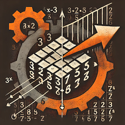

# vectormatrix

Idiomatic Matrix and Vector types for Rust.

This crate implements small stack-allocated Vector and Matrix types with the obvious semantics and operations.
`no_std` support and zero dependencies.

# Core Types

* `Vector<T, N>` - An N-dimensional vector with elements of type T
* `NormalizedVector<T, N>` - A unit vector (length = 1.0) with compile-time guarantee
* `Matrix<T, R, C>` - An R×C matrix with elements of type T

# Operations

Most obvious matrix and vector operations including:
* scalar addition, subtraction, multiplication, and division with operator overloading
* elementwise addition, subtraction, multiplication, and division with operator overloading
* map operations for transforming elements
* approximate equality for floating point types

## Vector operations
* dot product
* cross product (3D vectors only)
* length, square length
* normalization to unit vector
* euclidean distance
* convert to/from row and column matrix
* element access via x(), y(), z(), w() methods or indexing
* min/max element finding
* clamping and linear interpolation (mix)

## Matrix operations
* matrix multiplication
* transpose
* determinant (for 2×2, 3×3, and 4×4)
* inverse (for 2×2, 3×3, and 4×4)
* common affine transformations for 3×3 and 4×4 matrices:
  - translation
  - rotation (2D for 3×3, 3D axis-aligned for 4×4)
  - scaling
  - shearing
* column and row access
* element access via element_at() or direct column indexing

# Type design

* Use generics to support any element type with appropriate numeric traits
* Use const generics to encode dimensions in the type system and enable stack allocation
* Column-major storage for cache efficiency and graphics API compatibility
* Where practical, use generics for optimized code at any matrix size
* Where mathematically appropriate, implement particular algorithms for particular size
* All operations are inlined for maximum performance
* Use `repr(Rust)` so that the compiler may optimize memory layout for SIMD
  (Convert to your own `repr(C)` type if you need specific memory layout)
* API design supports future SIMD or hardware accelerated operations

# Supported numeric types

The library provides trait implementations for standard numeric types:
* Floating point: `f32`, `f64` (with additional operations like sqrt, sin, cos)
* Unsigned integers: `u8`, `u16`, `u32`, `u64`
* Signed integers: `i8`, `i16`, `i32`, `i64`

# Features

* `std` (default): Enables standard library support for floating point functions like sqrt, sin, cos
* Without `std`: Core functionality works in `no_std` environments